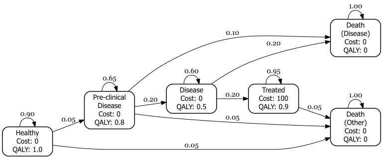
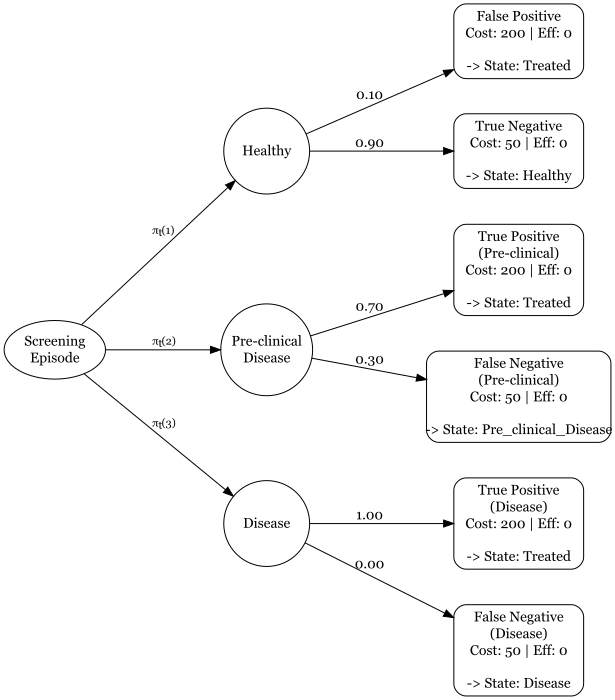

# Introduction

Cost-effectiveness analysis (CEA) in healthcare is the comparative assessment of alternative courses of action, evaluating both their relative costs and downstream consequences [@drummond2015methods]. To conduct these evaluations, health economists frequently rely on mathematical modelling. These models are becoming more powerful and complex. One feature of this is that models may consist of multiple linked components designed to capture different phases of a disease or treatment pathway.

In particular, a widely used structural approach in CEA combines a two-part model. This is particularly common when evaluating pathways such as population screening programs or acute hospital care [@Sandercock2004]. This consists of an initial stage where a decision-making process and intervention are undertaken. An individual would be evaluated and treated according to certain deterministic and random considerations. The subsequent stage simulates the consequences of the first stage on the population depending on the previous results [@briggs2006decision]. For example, individuals may be invited to screening and given treatment according to the results of an imperfect test. Then their long term outcomes are estimated, with the population split into true positive, true negative, false positive and false negatives who may or may not have agreed to take the treatment which may not have been effective. Outcomes for the second stage may include progression to disease, side effects from treatment, and mortality.

There are general modelling and software engineering issues with the legacy multiple component modelling approach. These are either disjoint models or ad-hoc single scripts. This produces models which are error prone, hard to test, reproduce or extend. In HTA projects it is often required to modify or repurpose existing models, and the existing approach can be inefficient and time consuming. In addition, it is usual in a cost-effectiveness analysis to explore several (possibly many) alternative interventions. Each of these may have different sets of unit costs, health values, probabilities and possibly (but less common) model structure. This would require the management of these alongside the plugging in of model output as model inputs between components. The analysis pipeline or workflow thus has potentially many 'moving parts', any one of which can introduce a bug or error which would affect the calculation and the optimal decision.

There appears a consensus that modern code for health economics modelling is not fit for purpose. @Kent2019 and @Wu2019 argue that there is often a lack of clear code structure in health economics models which makes it difficult for third parties to validate them. We will propose an approach which solves this by making the pipeline visible and not buried in nested loops. This sentiment is repeated in @Eddy2012MDM, who state that a model should be "reproducible by another team of investigators." @AlaridEscudero2019 explicitly discuss the need for modularity, highlighting that complex models should be broken down into reusable components to reduce the risk of "technical debt" and error rates. @Jalal2017 discusses how although R is powerful it lacks a standard structure and so modelling code is often poorer for it. They advocate for formal structures to ensure models can be audited. @Krijkamp2018 provide a checklist that emphasizes modularity and input-output consistency. We will propose a way to formalize the "hand-off" that is usually handled with messy global variables.

@Krijkamp2018 adopt a 'bridge' or data translator function to map between models. This formalises how to distribute individuals across starting state of the long-term model. This is an improvement from the hard-coded implementation often seen in other models. However, this is still part of a sequential script rather than a formalised framework. We propose going beyond simply 'good coding style' to 'software engineering' practice. They manually chain components but this can be managed or 'orchestrated' automatically as part of the framework.

Although CEA models have been traditionally built in Microsoft Excel, their increasing sophistication has driven a shift toward computational programming languages like R [@rlanguage]. Despite this transition, the field has largely failed to adopt modern programming paradigms. In particular, analysts often treat interconnected submodels as isolated scripts, missing the opportunity to leverage the architectural benefits of a programmatic framework. In software engineering, integrating separate components into a unified system is a well-established discipline that relies on a modular approach—breaking a program into distinct, functional blocks which interact with one another in standardised ways. Thus, a practical demonstration of how to straightforwardly implement multi-component CEA models following software engineering best practices could address this gap.

# General problem

As an example which we will keep returning to in this article, we will consider a particular type of the two-stage model already introduced. This process can be represented with a decision tree model (DT) and Markov model (MM). These are often used in combination to represent acute or short-term, and chronic or long-term (population) impacts since DTs do not explicitly represent time, unlike MM. An order of operation is as follows:

i. Read in external data model inputs
ii. Simulate the population sizes (or proportions) of the terminal state, and health and cost for the DT model
iii. Pass the DT output to the MM as input
iv. Simulate the health and cost values for the MM
v. Pass the DT and MM outputs to the Decision model
vi. Process the combined results of the DT and MM
vii. Repeat steps (i)-(vi) for a probabilistic sensitivity analysis (PSA)

This process is represented in the flowchart in @fig-flowchart-combined. The data may be passed amongst the modules directly, which is reasonable with the same software. Alternatively, the data may be stored externally in intermediate steps and then read in when required. The diagram can be read roughly from left to right, corresponding to (i) to (vi) above. It is not uncommon for different submodels to be implemented in different software such as MS Excel, R, Python, and Stata. We will not detail the inference stage where the parameters of the model are estimated. This can be done in a frequentist or Bayesian paradigm.

There are already several excellent tutorials on how to build simple DT models or MM for cost-effectiveness analysis. The intention of this paper is to build on these and develop the scope of applications to more realistic problems encountered in industry and regulatory submissions. It was sensible to start with simpler tutorials when people from other software, such as MS Excel, are brought to programmatic implementations such as R, but there is a desire now to further develop the available toolkit and skill in the field.

{#fig-flowchart-combined width=90%}

# A unified framework

In this paper, we propose a unified and structured approach to building cost-effectiveness models using declarative rather than imperative programming. Unlike the traditional imperative approach — where the programmer manually manages every computational step to dictate how a task is carried out — declarative programming focuses on logically describing what the program should accomplish. Key characteristics of this approach include the abstraction of control flow and the automatic handling of background implementation details. In the context of unifying a decision tree (DT) and Markov model (MM), this framework simplifies the simulation and cost-effectiveness calculations while automatically managing the flow of data between modules.

This framework does not replace good modelling practice, such as modularity, but rather supports and strengthens it. While some might worry that bundling parts of a model together (i.e., increasing "coupling") can make code harder to manage, our framework is designed to avoid these problems and instead promote clarity, reusability, and scalability. Through reframing an existing model, we highlight the benefits of moving to an object-oriented programming (OOP) approach.

In practical terms, this approach simplifies and clarifies key aspects of the modelling process. Specifically, it streamlines how simulations are executed (e.g., cohort transitions through a DT or MM), how costs and health outcomes are calculated, and how data seamlessly flows between distinct model components.

# S3 and object-oriented programming in R

A cornerstone of our approach is the use of S3 OOP in R. The broader statistical computing and data science communities have long leveraged R's native S3 object-oriented system to unify disparate modelling architectures, notably seen in the *tidymodels* [@tidymodels] ecosystem. Meanwhile, health technology assessment (HTA) tutorials have largely overlooked this approach. Current HTA model development in R typically relying on rigid, imperative scripting that mimics legacy spreadsheet logic. We demonstrate how S3 method dispatch can serve as a lightweight, native adaptor to seamlessly link sequential model components (e.g., decision trees and Markov models) into a unified pipeline. @tbl-s3classes gives an overview of some common S3 object classes in R.

S3 OOP helps to manage model structure more cleanly. For instance, we can define a *generic* function like `print()` or `summarize()` that works differently depending on the type of object it is applied to (e.g., a DT vs. a MM). R automatically chooses the correct method based on the *class* of the input, a process known as method *dispatch*. In R, S3 class is just a standard R data structure (usually a list) that has a class attribute assigned to it.

By decoupling the generic interface from its specific implementation, this approach facilitates highly reusable code. Instead of maintaining separate simulation functions for distinct model structures, an analyst can define a single common interface. R's internal method dispatch mechanism then automatically executes the correct subroutine. In OOP terminology, this is called *polymorphism*. This architectural shift provides several key methodological advantages:

* **Unification:** Disparate model types (e.g., decision trees and Markov models) can be manipulated through a single, consistent syntax.
* **Efficiency:** It minimizes code redundancy and reduces the risk of manual transcription errors.
* **Maintainability:** It yields a modular codebase that is easier to debug, audit, and extend.
* **Extensibility:** It permits the addition of novel model structures or summary functions without necessitating changes to the core logic.

Ultimately, deploying S3 object-oriented programming formalizes cost-effectiveness models as distinct computational objects with consistent behaviours, substantially enhancing analytical extensibility, transparency and structural flexibility.

| S3 Class | Description |
|:---|:---|
| `data.frame` | A tabular data structure with rows and columns. Most common S3 class in R. |
| `lm` | Linear model object created by `lm()`. Stores coefficients, residuals, etc. |
| `factor` | A categorical variable with levels. Internally stored as integers with labels. |
| `ts` | Time-series object with time indexing. Used for modelling temporal data. |

: Examples of S3 classes in R and how they are defined. {#tbl-s3classes}

## R code S3 example

Below is a full example of using S3 method dispatch in R. We define a custom generic function to print to the console `printModel()` and two class-specific methods for objects of class "`MarkovModel`" and "`DiseaseModel`".

```{r}
# Create a generic function for printing model objects
printModel <- function(x, ...) {
  UseMethod("printModel")
}

# Method for class "MarkovModel"
printModel.MarkovModel <- function(x, ...) {
  cat(
    "A Markov model with states:", 
    paste(x$states, collapse = ", "), "\n")
}

# Method for class "DiseaseModel"
printModel.DiseaseModel <- function(x, ...) {
  cat(
    "Disease model states:", 
    paste(x$states, collapse = " -> "), "\n")
}

# Define an object of class "MarkovModel"
x1 <- list(states = c("Healthy", "Sick", "Dead"))
class(x1) <- "MarkovModel"

# Define an object of class "DiseaseModel"
x2 <- list(states = c("Mild", "Severe", "Death"))
class(x2) <- "DiseaseModel"

# Call generic function ---

# Dispatches to printModel.MarkovModel
printModel(x1)

# Dispatches to printModel.DiseaseModel
printModel(x2)
```

This demonstrates the core idea behind S3 where the method dispatch depends on the class of the object passed to `printModel()`. Additionally, objects can have more than one class and in this case methods are dispatched in sequence.

Although the primary example in this paper focuses on using S3 to manage macro-level workflows—specifically the integration of modular `DecisionTree` and `MarkovModel` objects—the benefits of OOP extend equally to micro-level data management. We strongly recommend that analysts assign explicit classes to granular, user-defined types, such as cost, QALY, or probability. In legacy imperative scripting, health economists frequently rely on standard numeric arrays or data frames, forcing them to clutter their functions with repetitive assert or `stopifnot` statements to prevent silent data-type errors (e.g., inadvertently multiplying a cost vector by another cost vector instead of a probability). By replacing these fundamental inputs with S3 classes, analysts can leverage method dispatch to handle validation and operations elegantly. For example, a generic `discount()` or `convert_country()` function can be designed to apply entirely different logic depending on whether it receives a cost object or a QALY object, ensuring robust, type-safe calculations throughout the model pipeline.

## Model composition

To use computer science terminology, *function chaining* is a common implementation of what is generally called function *composition* (mathematically written $f(g(x))$), especially in object-oriented programming. In particular, a function that changes an output to something that can be used as an input to the next function is sometimes called a *transformation* function. This is what is required in our case to pipe from one model to the next. We can elegantly chain models using S3 OOP.

## System architecture

In an OOP architecture, managing the data flow between distinct components requires specific functional roles. To begin, *constructor* functions are required to instantiate the objects. These functions take raw input data and format them into a classed object (e.g., turning a standard list into a formal `DecisionTree` or `MarkovModel` object) so that generic functions know how to interact with it.

Once the objects are instantiated, linking different model components seamlessly relies on the "Adaptor pattern". In software engineering, an adaptor allows objects with incompatible interfaces to work together. For health economists, this can be thought of as a standardized "data translator".

For example, a DT might output a simple vector of patient proportions, but a MM might require a specific starting cohort matrix. Rather than cluttering the main analysis script with ad-hoc data manipulation code to bridge this gap, the Adaptor pattern acts as a dedicated bridge. This automatically converts the output of the source model into the exact format expected by the target model. This is implemented by wrapping the model execution in a function that handles the translation seamlessly behind the scenes:

```r
modelfun.modelclass <- function(x, ...) {
# 1. Translate incoming data into a format the model needs
# 2. Execute the model
# 3. Translate results back into a standardized output format
}
```

Finally, to manage the end-to-end execution of these linked models, an *orchestrator* function is employed. The orchestrator is responsible for iterating through the chain of assembled models, executing each one, and triggering the appropriate adaptors to pass the output of one model directly into the input of the next.

# Case study: Multiple screening episodes

We reframe a previously published screening CEA model, built for the purposes of teaching and training in R [@lin2023simple]. The example will demonstrate the different implementation approaches in a real-world case study. This is a CEA model that involves multiple screening sessions over a lifetime where, at the point of every screening session, individuals can be redistributed across health states in a MM based on their screening results [@Afonso2023; @Hazen2002; @hollenberg1984markov].

## Data

The scenarios included are for five screening intervals of 2, 5, 10, 15, 20 years, and six total number of screening episodes 1, 2, 3, 4, 5, 10. @fig-screening-model shows the high-level diagram of the screening model from @lin2023simple. The Markov model and decision tree diagrams are shown in @fig-markov-model and @fig-decision-tree-model.

The data for the Markov model consist of the state transition probability matrix
$$
P = \begin{bmatrix}
0.9 & 0.05 & 0 & 0 & 0 & 0.05 \\
0 & 0.65 & 0.2 & 0 & 0.1 & 0.05 \\
0 & 0 & 0.6 & 0.20 & 0.2 & 0 \\
0 & 0 & 0 & 0.95 & 0 & 0.05 \\
0 & 0 & 0 & 0 & 1.0 & 0 \\
0 & 0 & 0 & 0 & 0 & 1
\end{bmatrix}
$$
and the unit state cost and health attributes are
$$
\mathbf{c}^{M} = (0, 0, 0, 100, 0, 0)^{\top}, \quad \mathbf{u}^{M} = (1, 0.8, 0.5, 0.9, 0, 0)^{\top}
$$
The $M$ superscript indicates that these are for the Markov model. The data for the decision tree consist of the conditional transition probabilities along each branch
$$
\begin{aligned}
P(\text{FP} \mid \text{Healthy}) &= 0.1 \\
P(\text{TN} \mid \text{Healthy}) &= 0.9 \\[6pt]
P(\text{TP} \mid \text{Pre-clinical}) &= 0.7 \\
P(\text{FN} \mid \text{Pre-clinical}) &= 0.3 \\[6pt]
P(\text{TP} \mid \text{Disease}) &= 1.0 \\
P(\text{FN} \mid \text{Disease}) &= 0.0
\end{aligned}
$$
and terminal state costs $c^{D}(x) = 200$ if TP or FP, and $c^{D}(x) = 50$ if TN or FN. The $D$ superscript indicates that these are for the decision tree.

Finally, the initial distribution of individuals amongst the states of the Markov model is defined as
$$
\mathbf{\pi}_0 = (0.80, 0.15, 0.05, 0, 0, 0)^{\top}
$$
Notice that the simulation begins with a decision tree model screening round. The distribution of individuals at the start of a screening episode is represented with the branches from the root node of the decision tree which are therefore time-dependent.

{#fig-screening-model width=100%}

{#fig-markov-model width=100%}

{#fig-decision-tree-model width=100%}

# R implementation

The analysis was carried-out in R version 4.6.0. All code is available on GitHub at <https://github.com/n8thangreen/modularce>. Because of limited space and to focus the exposition, we do not include function input checks (called *asserts*) and other additional code, which it is good practice to include.

The MM engine code is based on @Green2023 and is considered a black-box for our purposes. It is sufficient to define it in terms of the *contract*, that is, what values it requires as inputs and what output we can expect to obtain from it. We will principally use base R functions in the examples. This is to minimise the number of dependencies and make the code more robust and reproducible. We consider the CHEERS checklist [@husereau_consolidated_2022] for the key components of an analysis which we need to take account of in our proposed framework. We do not discount costs or health to present values for this simple model, but in practice this is a core consideration.

## S3 Framework

The framework leverages the S3 methodology to seamlessly transition patient cohorts. At each screening interval (2, 5, 10, 15, and 20 years), the DT calculates the immediate redistribution of individuals based on test outcomes. Instead of manual data hand-offs, the `update_model()` generic function captures these revised proportions and feeds them directly into the MM. This allows the MM to project long-term downstream costs and health outcomes continuously without breaking the computational pipeline.

The class constructor functions for a decision tree and a Markov model are:

```{r}
DecisionTree <- function(data, disc_rate = 0.035) {
  structure(
    list(data = data,
         discount_rate = disc_rate,
         start_cycle   = 0),
    class = c("DecisionTree", "Model"))
}

MarkovModel <- function(trans_matrix, 
                        costs, utils, 
                        init_probs = NULL, 
                        mapping = NULL, 
                        n_cycles = 2, 
                        disc_rate = 0.035) {
  structure(
    list(
      trans_matrix  = trans_matrix,
      cost_vector   = costs,
      util_vector   = utils,
      init_probs    = init_probs,
      mapping       = mapping,
      n_cycles      = n_cycles,
      discount_rate = disc_rate,
      start_cycle   = 0
    ),
    class = c("MarkovModel", "Model")
  )
}
```

The `structure()` function defines an object with additional attributes, in this case class.

We will also create a `CombinedModel()` constructor which will simply consist of a list of other models which have previously been created with their own class constructors as above. This structure will allow us to pass around a single object.

```{r}
CombinedModel <- function(...) {
  structure(list(...), 
            class = c("CombinedModel", "Model"))
}
```

We next define the generic functions, which are the polymorphic methods which will behave differently depending on what class of object is passed to them. This is 'boilerplate' R code which takes the same format every time.

```{r}
run_model <- function(model, ...) {
  UseMethod("run_model")
}

update_model <- function(model, result) {
  UseMethod("update_model")
}
```

The class-specific `run_model()` methods for each of the submodels are defined next:

```{r}
run_model.MarkovModel <- function(model, ...) {
  out <- markov_model(
    start_pop     = model$init_probs,
    trans_mat     = model$trans_matrix,
    cost_vec      = model$cost_vector,
    util_vec      = model$util_vector,
    n_cycles      = model$n_cycles,
    discount_rate = model$discount_rate,
    start_cycle   = model$start_cycle
  )
  
  list(
    expected_cost = out$expected_cost,
    expected_eff  = out$expected_eff,
    terminal      = out$final_state,
    trace         = out$trace,
    time_elapsed  = model$n_cycles
  )
}

run_model.DecisionTree <- function(model, ...) {
  path <- calculate_pathways(model$data)
  
  rate <- model$discount_rate
  cycle <- model$start_cycle
  
  discount_factor <- 1 / (1 + rate)^cycle
  
  list(
    expected_cost = sum(path$prob * path$cost) * discount_factor,
    expected_eff  = sum(path$prob * path$eff) * discount_factor,
    path_results  = path,
    time_elapsed  = 0
  )
}
```

As already stated, we assume the internal simulation engines of the decision tree, `calculate_pathways()`, and Markov model, `markov_model()`, as black boxes for our purposes. The full code is all available in the GitHub repo.

Next, we define the adaptor functions for each of the submodels. These are model-specific functions derived from the generic `update_model()`. In each case, results from the previous model in the pipeline are passed in and adapted appropriately to be input for the subsequent model, as defined by the class of the first argument.

```{r}
update_model.MarkovModel <- function(model, prev_result) {
  if (!is.null(prev_result$path_results) && !is.null(model$mapping)) {
    all_nm <- colnames(model$trans_matrix)
    new_init <- setNames(rep(0, length(all_nm)), all_nm)
    
    paths <- prev_result$path_results
    paths$state <- model$mapping[paths$terminal_node]
    
    # Sum the probabilities for each state
    for (s in unique(paths$state)) {
      new_init[s] <- sum(paths$prob[paths$state == s])
    }
    
    model$init_probs <- new_init
  }
  model
}

update_model.DecisionTree <- function(model, prev_result) {
  if (!is.null(prev_result$terminal)) {
    end_states <- prev_result$terminal
    tree <- model$data
    root_idx <- which(
      tree$from == "root" & 
        tree$to %in% names(end_states))
    tree$prob[root_idx] <- end_states[tree$to[root_idx]]
    model$data <- tree
  }
  model
}
```

The final key element is the orchestrator function. This higher-level function takes as first argument an object of class `CombinedModel` and steps through each of the component submodels by running and updating data for the appropriate submodel-specific methods of `run_model()` and `update_model()`.

```{r}
run_model.CombinedModel <- function(model, ...) {
  results <- list()
  current_time <- 0  # initialise internal clock
  
  for (i in seq_along(model)) {
    curr_model <- model[[i]]
    
    # stamps model with current time
    curr_model$start_cycle <- current_time
    
    if (i > 1) {
      curr_model <- update_model(curr_model, results[[i - 1]])
    }

    res <- run_model(curr_model)
    results[[i]] <- res
    
    # advance clock using self-reported elapsed time
    current_time <- current_time + res$time_elapsed
  }
  results
}
```

## Input data

Now that the function preparatory code is complete, the input data as defined in the Data section above are translated into R code. We define a simulation duration of 20 years and define the screening programme in terms of the time between screening and the number of screening episodes. The analysis will investigate all combinations of intervals and episode values.

```{r}
# Define the grid of parameters
time_horizon <- 20
t_between_screens <- 1:10
num_screens <- 1:10
# t_between_screens <- c(2, 5, 10, 15, 20)
# num_screens <- c(1, 2, 3, 4, 5, 10)
# Set your new discount rate
discount_rate <- 0.035
```

The decision tree data are defined as a `tribble()` from the *tibble* package which allows us to write it in the same format that it will be printed for clearer code (@fig-code-input-dt).

```{r}
#| label: fig-code-input-dt
#| fig-cap: "Decision tree input specification in R."

decision_tree <- tibble::tribble(
  ~from,                  ~to,                    ~prob, ~cost, ~eff,
  "root",                 "Healthy",              0.80,      0,    0,
  "root",                 "Pre_clinical_Disease", 0.15,      0,    0,  # Markov model
  "root",                 "Disease",              0.05,      0,    0,  # state 
  "root",                 "Treated",              0.00,      0,    0,  # distribution
  "root",                 "Death_from_Disease",   0.00,      0,    0,  
  "root",                 "Other_Cause_Death",    0.00,      0,    0,
  "Healthy",              "FP",                   0.10,    200,    0,  # False Positive
  "Healthy",              "TN",                   0.90,     50,    0,  # True Negative
  "Pre_clinical_Disease", "TP_Preclinical",       0.70,    200,    0,  # True Positive
  "Pre_clinical_Disease", "FN_Preclinical",       0.30,     50,    0,  # False Negative
  "Disease",              "TP_Disease",           1.00,    200,    0,  # True Positive
  "Disease",              "FN_Disease",           0.00,     50,    0   # False Negative
)
```

The Markov model transition probability matrix is defined in @fig-code-input-mm.

```{r}
#| label: fig-code-input-mm
#| fig-cap: "Markov model annual transition probability matrix input specification in R."

states <- c(
  "Healthy", "Pre_clinical_Disease", "Disease", "Treated", "Death_from_Disease", 
  "Other_Cause_Death")

trans_mat <- matrix(
  c(
    #    H     P     D     T     DD    OCD
    0.90, 0.05, 0.00, 0.00, 0.00, 0.05, # Healthy (H)
    0.00, 0.65, 0.20, 0.00, 0.10, 0.05, # Pre-clinical Disease (P)
    0.00, 0.00, 0.60, 0.20, 0.20, 0.00, # Clinical Disease (D)
    0.00, 0.00, 0.00, 0.95, 0.00, 0.05, # Treated (T)
    0.00, 0.00, 0.00, 0.00, 1.00, 0.00, # Death from Disease (DD) - Absorbing
    0.00, 0.00, 0.00, 0.00, 0.00, 1.00  # Other-Cause Death (OCD) - Absorbing
  ),
  nrow = 6, byrow = TRUE,
  dimnames = list(from = states, 
                  to = states)
)
```

The state cost and health values are defined as follows:

```{r}
cost_vec <- c(
  Healthy              = 0,
  Pre_clinical_Disease = 0,
  Disease              = 0,
  Treated              = 100,
  Death_from_Disease   = 0,
  Other_Cause_Death    = 0
)

util_vec <- c(
  Healthy              = 1.0,
  Pre_clinical_Disease = 0.8,
  Disease              = 0.5,
  Treated              = 0.9,
  Death_from_Disease   = 0.0,
  Other_Cause_Death    = 0.0
)

# Cohort distribution for natural history
init_pop <- c(
  Healthy              = 1.0,
  Pre_clinical_Disease = 0.0,
  Disease              = 0.0,
  Treated              = 0.0,
  Death_from_Disease   = 0.0,
  Other_Cause_Death    = 0.0
)
```

Finally, we need to define the mapping from the decision tree terminal nodes to the Markov model states:

```{r}
mapping <- c(
  FP                 = "Treated",
  TN                 = "Healthy",
  TP_Preclinical     = "Treated",
  FN_Preclinical     = "Pre_clinical_Disease",
  TP_Disease         = "Treated",
  FN_Disease         = "Disease",
  Death_from_Disease = "Death_from_Disease",
  Other_Cause_Death  = "Other_Cause_Death",
  Treated            = "Treated"
)
```

```{r markov-model}
#| echo: false

markov_model <- function(start_pop,
                         trans_mat,
                         cost_vec,
                         util_vec,
                         n_cycles = 2,
                         discount_rate = 0.035,
                         start_cycle = 0) {
  n_states <- ncol(trans_mat)
  s_names  <- colnames(trans_mat)
  
  if (is.null(names(start_pop))) {
    names(start_pop) <- s_names
  }
  
  # trace matrix has n_cycles + 1 rows (baseline + n transitions)
  trace <- matrix(NA, nrow = n_cycles + 1, ncol = n_states, 
                  dimnames = list(paste0("cycle_", 0:n_cycles), s_names))
  trace[1, ] <- start_pop
  
  for (t in 1:n_cycles) {
    trace[t + 1, ] <- trace[t, ] %*% trans_mat
  }
  
  # Apply continuous discounting for the true elapsed time (t=1 to t=n)
  times <- (start_cycle + 1):(start_cycle + n_cycles)
  disc_vec <- 1 / (1 + discount_rate)^times
  
  # Exclude baseline row (trace[1,]) from reward accumulation
  cycle_costs <- (trace[-1, , drop = FALSE] %*% cost_vec)[, 1] * disc_vec
  cycle_qalys <- (trace[-1, , drop = FALSE] %*% util_vec)[, 1] * disc_vec
  
  list(
    trace         = trace,
    final_state   = setNames(as.numeric(trace[n_cycles + 1, ]), s_names),
    expected_cost = sum(cycle_costs),
    expected_eff  = sum(cycle_qalys)
  )
}
```

```{r decision-tree-model}
#| echo: false

calculate_pathways <- function(tree_data) {
  # If passed a DecisionTree S3 object directly, unwrap its data
  if (inherits(tree_data, "DecisionTree")) {
    tree_data <- tree_data$data
  }
  
  # Traverse recursive/tabular pathways from 'root' to terminal leaves
  find_branches <- function(current_node, current_prob, current_cost, current_eff, path) {
    children <- tree_data[tree_data$from == current_node, ]
    if (nrow(children) == 0) {
      return(data.frame(
        path          = paste(path, collapse = " -> "),
        terminal_node = current_node,
        prob          = current_prob,
        cost          = current_cost,
        eff           = current_eff,
        stringsAsFactors = FALSE
      ))
    }
    
    res <- lapply(seq_len(nrow(children)), function(i) {
      row <- children[i, ]
      find_branches(
        current_node = row$to,
        current_prob = current_prob * row$prob,
        current_cost = current_cost + row$cost,
        current_eff  = current_eff + row$eff,
        path         = c(path, row$to)
      )
    })
    do.call(rbind, res)
  }
  
  find_branches("root", 1, 0, 0, "root")
}
```

```{r getter}
#| echo: false

get_costs <- function(x, ...) {
  UseMethod("get_costs")
}

get_effects <- function(x, ...) {
  UseMethod("get_effects")
}

get_costs.output_CombinedModel <- function(x, ...) {
  sum(unlist(lapply(x, \(elem) elem$expected_cost)), na.rm = TRUE)
}

get_effects.output_CombinedModel <- function(x, ...) {
  sum(unlist(lapply(x, \(elem) elem$expected_eff)), na.rm = TRUE)
}

# Fallback default in case the list was not tagged with the S3 class
get_costs.default <- function(x, ...) {
  if (is.list(x)) sum(unlist(lapply(x, \(elem) elem$expected_cost)), na.rm = TRUE) else as.numeric(x)
}

get_effects.default <- function(x, ...) {
  if (is.list(x)) sum(unlist(lapply(x, \(elem) elem$expected_eff)), na.rm = TRUE) else as.numeric(x)
}
```
## Analysis

Having established the simulation code and input data, it is straightforward to run the analysis inside of a loop over the scenarios.

```{r}
# Loop through scenarios and execute the unified framework

all_results <- list()
dt <- DecisionTree(decision_tree, disc_rate = discount_rate)

for (t_val in t_between_screens) {
  mm_scenario <- 
    MarkovModel(trans_matrix = trans_mat,
                costs = cost_vec,
                utils = util_vec,
                init_probs = init_pop,
                mapping = mapping,
                n_cycles = t_val,
                disc_rate = discount_rate)
  
  for (n_scr in num_screens) {
    total_time <- n_scr * t_val
    
    # Filter out impossible combinations that
    # exceed the 20-year time horizon
    if (total_time > time_horizon) next
    
    submodels <- rep(list(dt, mm_scenario), n_scr)
    n_models <- length(submodels)
    
    t_remain <- time_horizon - total_time
    if (t_remain > 0) {
      submodels[[n_models]]$n_cycles <- t_val + t_remain
    }
    
    screening_model <- do.call(CombinedModel, args = submodels)
    
    results_scenario <- run_model(screening_model)
    
    result_label <- paste0("t_between_", t_val, "_screens_", n_scr)
    
    all_results[[result_label]] <- list(
      t_between_screens = t_val,
      num_screens       = n_scr,
      results           = results_scenario
    )
  }
}
```

## Probabilistic sensitivity analysis

Probabilistic Sensitivity Analysis (PSA) is fundamentally streamlined under our unified framework. In a traditional basic approach, analysts must manually manage the extraction of DT outputs to feed into the MM for every single PSA iteration, which is both error-prone and computationally inefficient. By encapsulating the model within the `CombinedModel` class, a PSA simply requires applying a mapping function (such as `lapply()` in base R) over the probabilistic input distributions. The `run_model.CombinedModel()` function acts as the orchestrator, automatically handling the internal control flow and data passing for each iteration. This ensures that structural integrity is maintained across thousands of simulation runs without manual intervention.

## Design choices

Even within the proposed architecture there are several subjective design decisions to make, which can depend on the specifics of the problem at hand. One design choice is where in the code to perform the linking of models. One option is to chain the models together when we create them or another option is to do this at the same time as running the model. There are pros and cons to each approach.

Another issue is to do with the generalisability of linking models. Should the code use the information about which type of model is being linked from (source) and linked to (target)? In an OOP framework this would require something called *double dispatch* which is not the original intention of S3 in R but can be manufactured using it and is implemented in packages such as *vctrs* [@vctrs2026]. Taking into account these considerations, in our case study example we have placed the linking logic within the model running function. We have also assumed that given a target model, we then know what the source model is. This is reasonable in our context and keeps the code clean for demonstration purposes. An alternative version of our code using the double dispatch approach employed by *vctrs* is also available in the supplementary material. The newer and less adopted S7 OOP system in R does natively support multiple dispatch which could elegantly solve the problem with a little more advanced code. We provide a version of the code in the supplementary material.

Our decision to utilize an S3-based orchestrator to link sequential model components aligns with established best practices in modern R software engineering. For instance, the *tidymodels* ecosystem (specifically the *workflows* and *stacks* packages) relies heavily on S3 generics to handle the sequential passing of data between preprocessing steps, individual models, and ensemble meta-models.

A Unified Markup Language (UML) diagram of the code structure is given in Appendix @fig-UML. This shows how all of the functions are related to each other.

# Results

@fig-occupy-combined illustrates the state occupancy over a 20-year time horizon for the 2-year and 10-year screening intervals. These plots demonstrate the expected dynamics: more frequent screening redistributes the population more rapidly into the "Treated" and "Disease" states. 

```{r}
#| label: fig-occupy-combined
#| fig-cap: "State occupancy plots comparing 2-year and 10-year screening intervals."
#| fig-subcap: 
#|   - "2-yearly screening (10 rounds, 20-year horizon)"
#|   - "10-yearly screening (2 rounds, 20-year horizon)"
#| layout-ncol: 1
#| fig-width: 8
#| fig-height: 4.5
#| echo: false

library(ggplot2)

get_occupancy_trace <- function(combined_result) {
  # 1. Extract elements that contain a trace matrix (works with or without S3 class tag)
  mm_outputs <- Filter(function(x) !is.null(x$trace), combined_result)
  
  if (length(mm_outputs) == 0) {
    stop("No Markov model traces found in the supplied result object. Please check run_model output.")
  }
  
  # 2. Stitch trace matrices (drop duplicate cycle 0 from subsequent screening intervals)
  trace_list <- lapply(seq_along(mm_outputs), function(i) {
    tr <- mm_outputs[[i]]$trace
    if (i > 1) tr[-1, , drop = FALSE] else tr
  })
  
  full_matrix <- do.call(rbind, trace_list)
  
  # 3. Format as tidy tibble
  dplyr::as_tibble(full_matrix) |>
    dplyr::mutate(year = seq(0, nrow(full_matrix) - 1)) |>
    tidyr::pivot_longer(
      cols      = -year,
      names_to  = "state",
      values_to = "occupancy"
    ) |>
    dplyr::mutate(
      state     = factor(state, levels = states),
      rev_state = factor(state, levels = rev(states))
    )
}

plot_occupancy <- function(trace_data, title_text) {
  ggplot(trace_data, aes(x = year, y = occupancy, fill = rev_state)) +
    geom_col(position = "stack", width = 0.9) +
    scale_y_continuous(labels = scales::percent_format(accuracy = 1), expand = c(0, 0)) +
    scale_x_continuous(breaks = seq(0, 20, by = 2)) +
    scale_fill_brewer(palette = "Set2", name = "Health State") +
    labs(
      title = title_text,
      x     = "Year (Simulation Cycle)",
      y     = "Cohort Proportion"
    ) +
    theme_minimal(base_size = 12) +
    theme(
      legend.position = "right",
      panel.grid.minor = element_blank(),
      plot.title = element_text(face = "bold")
    )
}

trace_2y  <- get_occupancy_trace(all_results[["t_between_2_screens_10"]]$results)
trace_10y <- get_occupancy_trace(all_results[["t_between_10_screens_2"]]$results)

plot_occupancy(trace_2y,  "State Occupancy: 2-Yearly Screening (20-Year Horizon)")
plot_occupancy(trace_10y, "State Occupancy: 10-Yearly Screening (20-Year Horizon)")
```


@fig-ce-plot synthesizes the cost-effectiveness across the full grid of evaluated screening strategies, plotting total accumulated costs against total health outcomes. As expected from a structurally sound health economic evaluation, the results display clear efficiency trade-offs. Strategies utilizing highly frequent screening intervals (e.g., the 2-year interval curve) yield the highest overall health benefits by capturing clinical transitions earlier, but they do so at a significantly steeper marginal cost trajectory due to compounding screening and treatment expenses. Conversely, less frequent screening (e.g., the 15- and 20-year intervals) produces lower-cost outcomes with correspondingly reduced health gains. 

Importantly, the smooth and mathematically predictable progression of these curves—scaling logically with the number of screening episodes—demonstrates that the declarative S3 framework functions exactly as intended. It confirms that the object-oriented architecture correctly accumulates costs and propagates complex cohort transitions between the DT and MM without the silent data-loss or misallocation errors common in manual imperative scripts.

```{r}
#| label: fig-ce-plot
#| fig-cap: "Cost-effectiveness plot for screening intervals of 1 to 5 years, with all screening episodes numbered."
#| fig-width: 8
#| fig-height: 5
#| echo: false

# 1. Build the data and filter for intervals 1 through 5
ce_data <- dplyr::tibble(
  t_interval = factor(vapply(all_results, \(x) x$t_between_screens, numeric(1))),
  n_screens  = vapply(all_results, \(x) x$num_screens, numeric(1)),
  cost       = vapply(all_results, \(x) get_costs(x$results), numeric(1)),
  qalys      = vapply(all_results, \(x) get_effects(x$results), numeric(1))
) |> 
  dplyr::filter(t_interval %in% as.character(1:5))

ggplot(ce_data, aes(x = qalys, y = cost, color = t_interval, group = t_interval)) +
  geom_point(size = 2.5) +
  geom_path(linewidth = 1) +
  # 2. Number every point by passing the default data
  geom_text(aes(label = n_screens), vjust = -0.8, size = 3.2, show.legend = FALSE) +
  scale_color_viridis_d(name = "Screening Interval\n(Years)") +
  scale_x_continuous(breaks = scales::pretty_breaks(n = 8)) +
  labs(
    x = "Total Health Gain (QALYs)",
    y = "Total Expected Cost (£)"
  ) +
  theme_minimal(base_size = 12) +
  theme(
    panel.grid.minor = element_blank(),
    plot.title       = element_text(face = "bold"),
    legend.position  = "right"
  )
```

# Changes in Model and Data

As for the previous example, the PSM engine it assumed a blackbox for our purposes so is not shown here but all code is avaialable in the GitHub repository.

```{r}
#| label: fig-natural-history
#| fig-cap: "Natural history state occupancy with fitted PartSA survival curves (PFS and OS)."
#| fig-width: 8
#| fig-height: 5
#| echo: false

# 1. Natural History Analysis
init_nh <- c(
  Healthy              = 0.80,
  Pre_clinical_Disease = 0.15,
  Disease              = 0.05,
  Treated              = 0.00,
  Death_from_Disease   = 0.00,
  Other_Cause_Death    = 0.00
)

mm_nh <- MarkovModel(
  trans_matrix = trans_mat,
  costs        = cost_vec,
  utils        = util_vec,
  init_probs   = init_nh,
  mapping      = mapping,
  n_cycles     = 20,
  disc_rate    = discount_rate
)
res_nh <- run_model(mm_nh)
trace_nh <- res_nh$trace

# 2. Extract PFS and OS
time_seq <- 0:20
pfs_trace <- trace_nh[, "Healthy"]
os_trace <- 1 - (trace_nh[, "Death_from_Disease"] + trace_nh[, "Other_Cause_Death"])

# 3. Fit exponential models using log-linear regression to avoid non-convergence on exact fits
pfs_df <- data.frame(t = time_seq, prop = as.numeric(pfs_trace))
os_df  <- data.frame(t = time_seq, prop = as.numeric(os_trace))

fit_pfs_lm <- lm(log(prop) ~ t, data = pfs_df)
fit_os_lm  <- lm(log(prop) ~ t, data = os_df)

a_pfs <- exp(coef(fit_pfs_lm)[["(Intercept)"]])
b_pfs <- -coef(fit_pfs_lm)[["t"]]
a_os  <- exp(coef(fit_os_lm)[["(Intercept)"]])
b_os  <- -coef(fit_os_lm)[["t"]]

# Define survival functions for PartSA
fit_pfs <- function(t) a_pfs * exp(-b_pfs * t)
fit_os  <- function(t) a_os  * exp(-b_os * t)

# 4. Plot Natural History with Fitted Curves
trace_long <- as.data.frame(trace_nh) |>
  dplyr::mutate(t = time_seq) |>
  tidyr::pivot_longer(cols = -t, names_to = "state", values_to = "occupancy") |>
  dplyr::mutate(
    state = factor(state, levels = states),
    rev_state = factor(state, levels = rev(states))
  )

fit_df <- data.frame(
  t = time_seq,
  PFS = fit_pfs(time_seq),
  OS = fit_os(time_seq)
)

ggplot2::ggplot() +
  ggplot2::geom_col(data = trace_long, ggplot2::aes(x = t, y = occupancy, fill = rev_state), width = 0.9) +
  ggplot2::geom_line(data = fit_df, ggplot2::aes(x = t, y = PFS, linetype = "PFS"), linewidth = 1) +
  ggplot2::geom_line(data = fit_df, ggplot2::aes(x = t, y = OS, linetype = "OS"), linewidth = 1) +
  ggplot2::scale_fill_brewer(palette = "Set2", name = "Health State") +
  ggplot2::scale_linetype_manual(name = "Fitted Survival", values = c("PFS" = "dashed", "OS" = "solid")) +
  ggplot2::scale_y_continuous(labels = scales::percent_format(accuracy = 1), expand = c(0, 0)) +
  ggplot2::labs(
    title = "Natural History State Occupancy & Fitted Survival Curves",
    x = "Year (Simulation Cycle)",
    y = "Cohort Proportion"
  ) +
  ggplot2::theme_minimal(base_size = 12) +
  ggplot2::theme(legend.position = "right")
```

```{r}
#| echo: false

run_partsa_engine <- function(pfs_fit, os_fit, weights, horizon, start_cycle = 0, discount_rate = 0.035, treated_prev = 0, untreated_prev = 1) {
  
  # Calculate scale factor for untreated pool to adjust for cohort moving into Treated
  os_at_start <- os_fit(start_cycle)
  k <- if (os_at_start > 0) untreated_prev / os_at_start else 0
  
  # Calculate area under the curve (AUC) for time in states (discounted, right-Riemann sum)
  if (horizon > 0) {
    t_reward <- seq(start_cycle + 1, start_cycle + horizon, by = 1)
    disc_vec <- 1 / (1 + discount_rate)^t_reward
    
    auc_pfs <- sum(pfs_fit(t_reward) * k * disc_vec)
    auc_os  <- sum(os_fit(t_reward) * k * disc_vec)
    
    # Treated state decays independently at 0.95 per year
    t_interval <- seq(1, horizon, by = 1)
    treated_curve <- treated_prev * (0.95^t_interval)
    auc_treated <- sum(treated_curve * disc_vec)
    
    time_pf   <- auc_pfs
    time_pd   <- auc_os - auc_pfs
    time_treated <- auc_treated
    
    time_total <- sum(disc_vec)
    time_dead <- time_total - auc_os - auc_treated
  } else {
    time_pf <- 0; time_pd <- 0; time_treated <- 0; time_dead <- 0
  }
  
  # Map PartSA states to the 6 Markov states
  state_time <- c(
    Healthy              = time_pf,
    Pre_clinical_Disease = time_pd / 2,
    Disease              = time_pd / 2,
    Treated              = time_treated,
    Death_from_Disease   = time_dead / 2,
    Other_Cause_Death    = time_dead / 2
  )
  
  # Generate trace for state occupancy plotting (undiscounted, includes baseline)
  t_trace <- seq(start_cycle, start_cycle + horizon, by = 1)
  t_int_trace <- seq(0, horizon, by = 1)
  treated_curve_trace <- treated_prev * (0.95^t_int_trace)
  
  trace <- matrix(0, nrow = length(t_trace), ncol = 6)
  colnames(trace) <- c("Healthy", "Pre_clinical_Disease", "Disease", 
                       "Treated", "Death_from_Disease", "Other_Cause_Death")
  trace[, "Healthy"]              <- pfs_fit(t_trace) * k
  trace[, "Pre_clinical_Disease"] <- (os_fit(t_trace) - pfs_fit(t_trace)) / 2 * k
  trace[, "Disease"]              <- (os_fit(t_trace) - pfs_fit(t_trace)) / 2 * k
  trace[, "Treated"]              <- treated_curve_trace
  
  alive_trace <- trace[, "Healthy"] + trace[, "Pre_clinical_Disease"] + trace[, "Disease"] + trace[, "Treated"]
  trace[, "Death_from_Disease"]   <- (1 - alive_trace) / 2
  trace[, "Other_Cause_Death"]    <- (1 - alive_trace) / 2
  
  list(
    state_costs = state_time,
    state_qalys = state_time,
    mesh = cbind(PFS = pfs_fit(t_trace), OS = os_fit(t_trace)),
    trace = trace
  )
}

map_ps <- mapping
```

### Submodel substitution

From a Markov model to a partitioned survival model (PSM).

```{r}
# constructor
PartSAModel <- function(surv_pfs, surv_os, cost_vector, 
                        qaly_vector, mapping = NA,
                        time_horizon = 10,
                        discount_rate = 0.035) {
  structure(
    list(
      surv_pfs       = surv_pfs,     # parametric survival curves
      surv_os        = surv_os,
      cost_vector    = cost_vector,
      qaly_vector    = qaly_vector,
      mapping        = mapping,      # links tree terminal nodes to baseline survival risk
      time_horizon   = time_horizon,
      discount_rate  = discount_rate,
      start_cycle    = 0,
      treated_prev   = 0,
      untreated_prev = 1
    ),
    class = c("PartSAModel", "Model")
  )
}
```

S3 methods

```{r}
#' S3 update method: Ingests Decision Tree outputs
#' into PartSA baseline parameters
update_model.PartSAModel <- function(model, result) {
  if (!is.null(result$path_results) && !is.null(model$mapping)) {
    paths <- result$path_results
    paths$state <- model$mapping[paths$terminal_node]
    model$treated_prev <- sum(paths$prob[paths$state == "Treated"])
    model$untreated_prev <- sum(paths$prob[paths$state %in% c("Healthy", "Pre_clinical_Disease", "Disease")])
  }
  model
}
```

```{r}
#' S3 runner method: Solves the area under the curves
run_model.PartSAModel <- function(model) {
  # Evaluate partitioned survival areas 
  # (PFS, OS - PFS, 1 - OS)
  out <- run_partsa_engine(
    pfs_fit        = model$surv_pfs, 
    os_fit         = model$surv_os, 
    weights        = model$baseline_weights,
    horizon        = model$time_horizon,
    start_cycle    = model$start_cycle,
    treated_prev   = model$treated_prev,
    untreated_prev = model$untreated_prev
  )
  
  structure(
    list(
      expected_cost = sum(out$state_costs * model$cost_vector),
      expected_eff  = sum(out$state_qalys * model$qaly_vector),
      survival_mesh = out$mesh,
      trace         = out$trace,
      terminal      = setNames(as.numeric(out$trace[nrow(out$trace), ]), colnames(out$trace)),
      time_elapsed  = model$time_horizon
    ),
    class = c("output", class(model))
  )
}
```

Analysis

```{r PartSA-grid}
#| echo: true

# Run the full grid of scenarios using PartSA
all_results_ps <- list()
for (t_val in t_between_screens) {
  for (n_scr in num_screens) {
    total_time <- n_scr * t_val
    if (total_time > time_horizon) next
    
    ps_scenario <- PartSAModel(
      surv_pfs = fit_pfs, surv_os = fit_os, 
      cost_vector = cost_vec, qaly_vector = util_vec, 
      mapping = map_ps, time_horizon = t_val, 
      discount_rate = discount_rate
    )
    
    submodels <- rep(list(dt, ps_scenario), n_scr)
    n_models <- length(submodels)
    
    t_remain <- time_horizon - total_time
    if (t_remain > 0) {
      submodels[[n_models]]$time_horizon <- t_val + t_remain
    }
    
    ps_chain <- do.call(CombinedModel, args = submodels)
    res_ps <- run_model(ps_chain)
    
    result_label <- paste0("t_between_", t_val, "_screens_", n_scr)
    all_results_ps[[result_label]] <- list(
      t_between_screens = t_val,
      num_screens       = n_scr,
      results           = res_ps
    )
  }
}
```

```{r}
#| label: fig-occupy-combined-ps
#| fig-cap: "State occupancy plots comparing 2-year and 10-year screening intervals using the PartSA model."
#| fig-subcap: 
#|   - "2-yearly screening (10 rounds, 20-year horizon)"
#|   - "10-yearly screening (2 rounds, 20-year horizon)"
#| layout-ncol: 1
#| fig-width: 8
#| fig-height: 4.5
#| echo: false

combine_ps_states <- function(trace_data) {
  plot_states <- c("Healthy", "Disease", "Treated", "Dead")
  trace_data |>
    dplyr::mutate(
      state = dplyr::case_when(
        state %in% c("Death_from_Disease", "Other_Cause_Death") ~ "Dead",
        state %in% c("Pre_clinical_Disease", "Disease") ~ "Disease",
        TRUE ~ as.character(state)
      )
    ) |>
    dplyr::group_by(year, state) |>
    dplyr::summarise(occupancy = sum(occupancy), .groups = "drop") |>
    dplyr::mutate(
      state     = factor(state, levels = plot_states),
      rev_state = factor(state, levels = rev(plot_states))
    )
}

trace_2y_ps  <- combine_ps_states(get_occupancy_trace(all_results_ps[["t_between_2_screens_10"]]$results))
trace_10y_ps <- combine_ps_states(get_occupancy_trace(all_results_ps[["t_between_10_screens_2"]]$results))

plot_occupancy(trace_2y_ps,  "PartSA State Occupancy: 2-Yearly Screening")
plot_occupancy(trace_10y_ps, "PartSA State Occupancy: 10-Yearly Screening")
```

```{r}
#| label: fig-ce-plot-ps
#| fig-cap: "Cost-effectiveness plot for PartSA screening intervals of 1 to 5 years."
#| fig-width: 8
#| fig-height: 5
#| echo: false

ce_data_ps <- dplyr::tibble(
  t_interval = factor(vapply(all_results_ps, \(x) x$t_between_screens, numeric(1))),
  n_screens  = vapply(all_results_ps, \(x) x$num_screens, numeric(1)),
  cost       = vapply(all_results_ps, \(x) get_costs(x$results), numeric(1)),
  qalys      = vapply(all_results_ps, \(x) get_effects(x$results), numeric(1))
) |> 
  dplyr::filter(t_interval %in% as.character(1:5))

ggplot(ce_data_ps, aes(x = qalys, y = cost, color = t_interval, group = t_interval)) +
  geom_point(size = 2.5) +
  geom_path(linewidth = 1) +
  geom_text(aes(label = n_screens), vjust = -0.8, size = 3.2, show.legend = FALSE) +
  scale_color_viridis_d(name = "Screening Interval\n(Years)") +
  scale_x_continuous(breaks = scales::pretty_breaks(n = 8)) +
  labs(
    title = "PartSA Cost-Effectiveness Plane",
    x = "Total Health Gain (QALYs)",
    y = "Total Expected Cost (£)"
  ) +
  theme_minimal(base_size = 12) +
  theme(
    panel.grid.minor = element_blank(),
    plot.title       = element_text(face = "bold"),
    legend.position  = "right"
  )
```

### Structural Adaptations via S3 Class Specialisation

When a jurisdiction mandates a structural change—such as an alternative long-term extrapolation method or an additional post-progression therapy branch, we can use class derivation (e.g., `c("MarkovModel_PBAC", "MarkovModel", "Model")`).

```{r}
# PBAC structural variant: models continuous PBS dynamic market-share erosion
MarkovModel_PBAC <- function(trans_matrix, costs, utils, 
                             erosion_rate = 0.05, mapping = NULL, ...) {
  mod <- MarkovModel(trans_matrix = trans_matrix, costs = costs, 
                     utils = utils, mapping = mapping, ...)
  mod$erosion_rate <- erosion_rate
  class(mod) <- c("MarkovModel_PBAC", class(mod))
  mod
}

# Specific S3 method dispatch: PBAC applies market-share price cuts over cycles
run_model.MarkovModel_PBAC <- function(model) {
  # Apply country-specific dynamic erosion adjustment before running
  model$cost_vector <- model$cost_vector * (1 - model$erosion_rate)
  
  # Delegate core execution to base Markov runner
  NextMethod("run_model")
}
```

The `NextMethod()` function delegates the heavy matrix operations directly to the verified global engine (`run_model.MarkovModel`).
The central orchestrator `run_model.CombinedModel` runs without touching a line of code.


# Discussion
Traditional health economic models often bundle clinical pathways, cost inputs, and final calculations into a single, rigid script or spreadsheet, making them fragile and difficult to update. In contrast, our framework applies established software engineering standards—specifically the SOLID principles—to create a much more robust and adaptable system. By ensuring that each component has only one job (Single Responsibility), such as completely separating the clinical simulation from the economic payoffs, we drastically reduce the risk of errors when updating parameters. Furthermore, the architecture is designed so that new components, like a custom jurisdiction profile or a new sub-model, can be plugged into the pipeline without altering or breaking the core mathematical engine (Open-Closed Principle). Because all sub-models communicate through a standardised data contract, researchers can swap a Markov model for a different structure with confidence that the downstream calculations will still function perfectly (Liskov Substitution). Ultimately, this approach moves health economic modelling away from bespoke, tangled code and towards a transparent, modular infrastructure where each piece can be independently tested and trusted.

# Conclusion
We have demonstrated that adopting a declarative, object-oriented programming approach using S3 in R provides a robust and scalable solution for multi-component cost-effectiveness models. By abstracting the control flow and automating data transitions between DTs and MMs, this framework directly addresses the testability, reproducibility, and efficiency issues prevalent in legacy imperative scripts. Although moving away from traditional step-by-step coding requires a paradigm shift for many health economists, the resulting unified architecture aligns health technology assessment with modern software engineering best practices. Ultimately, this improves the transparency, flexibility, and reliability of the models used to inform critical healthcare decisions.

## Acknowledgements {.unnumbered}

xxx

## References {.unnumbered}

::: {#refs}
:::

# Appendix {.unnumbered}

## UML {#sec-uml}

![UML diagram for the decision tree - Markov model code. Inheritance / Generalization is a solid line with a large hollow (unfilled) triangle arrowhead pointing to the parent class in our case the decision tree and Markov model output; Implementation is a dashed line with a large hollow (unfilled) triangle arrowhead pointing to the interface, in our case the specific type of models; Dependency is a dashed line with an open arrowhead, the function on the right hand side of the diagram. The line with the unfilled diamond represents aggregation and "2..*" indicates that there are 2 or more models in `CombinedModel`.](UML.png){#fig-UML width=100%}